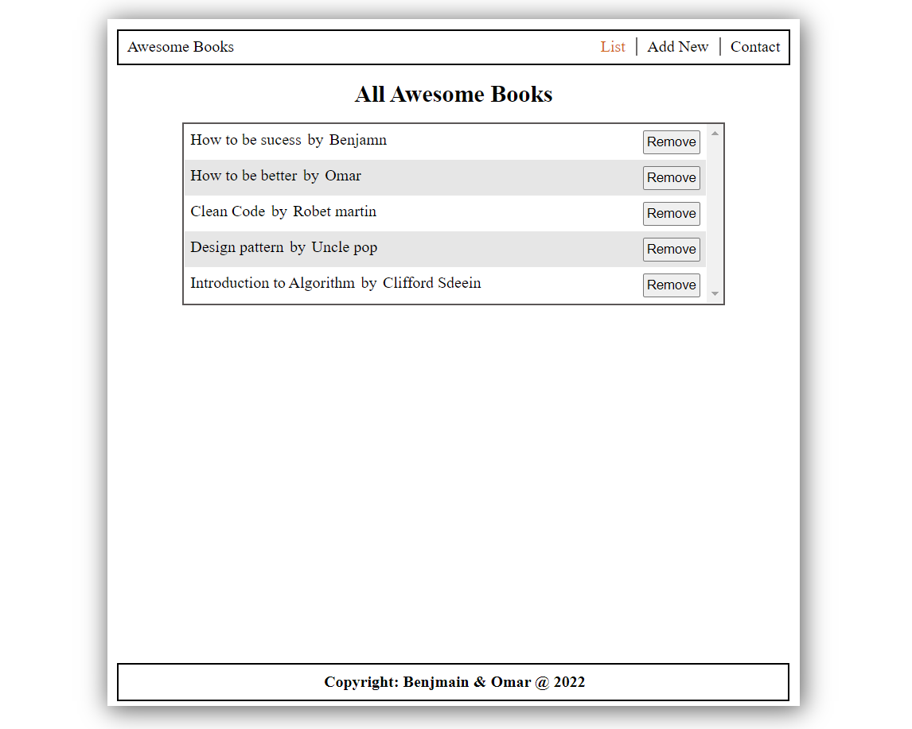

# AWESOME BOOKS

> This website Awesome Books Library provides users a convenient way to keep track of their books or reading lists. Users can add and remove books from the list of books they curate on the website.

## Built With

- HTML
- CSS
- JavaScript
- LocalStorage
- Linters
- Es6 modules

## Authors

👤 **Omar Salem**

- GitHub: [Omar Salem](https://github.com/omarsalem7)
- Twitter: [Omar Salem](https://twitter.com/Omar80491499)
- LinkedIn: [Omar Salem](https://www.linkedin.com/in/omar-salem-a6945b177/)

👤 **Benjamin Semah**

- GitHub: [Benjamin Semah](https://github.com/BenjaminSemah)
- Twitter: [Benjamin Semah](https://twitter.com/BenjaminSemah)
- LinkedIn: [Benjamin Semah](https://www.linkedin.com/in/benjaminsemah/)

## Show your support

Give a ⭐ if you like this project!
